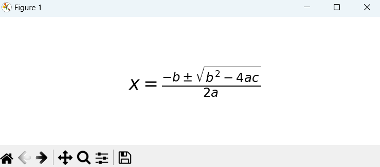

# marseCLI

A CLI that parses latex text and visualizes it using matplotlib

## Installation

1. Clone the repository:
   ```bash
   git clone https://github.com/33kc/marseCLI.git marse
   cd marse
   ```

2. Install the python packages:
   ```bash
   pip install -r requirements.txt
   ```
   
3. Add the marse folder (or the folder you cloned to) to your PATH for global access (optional):<Br>
  - One thing you need to configure is the path, <br>
  - On windows:
     ```
     @echo off
     python <path_to_main.py> %*
     ```
  - On Linux:
    ```
    #!/bin/bash
    python <path_to_main.py> "$@"
    ```
    change `<path_to_main.py>` in the bat file to the actual path.

## Usage

Arguments necessary:

```bash
marse -eq "<equation>"
```

### Example

The quadratic formula
```bash
marse -eq "x = \frac{-b \pm \sqrt{b^2 - 4ac}}{2a}"
```



## License

This project is licensed under the MIT License. See the [LICENSE](LICENSE) file for details.
